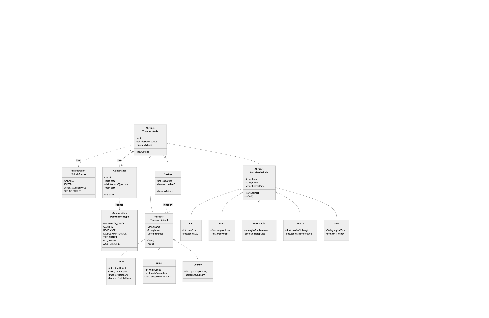

# 🚗 Car Rental System

A smart management application for rental agencies, built with Object-Oriented Programming (OOP) principles.

## 📖 About the Project

This project simulates a car rental agency system. It allows the manager to handle a vehicle fleet, manage customers, process rentals, and generate business reports. The core goal is to demonstrate **OOP concepts** like inheritance, encapsulation, and polymorphism.

## ✨ Key Features

### 1. 🚙 Fleet Management

Handle a diverse hierarchy of vehicles with specific attributes:

* **Cars** 🚗
* **Trucks** 🚚
* **Motorcycles** 🏍️
* **Hearses** ⚰️
* **Horses** (Saddle or carriage) 🐴
* **Karts** 🏎️
* **Features:** Track ID, brand, model, daily rate, and maintenance status.

### 2. 👥 Customer Center

Manage your client database efficiently:

* Store customer details (ID, Name, Age, License).
* Smart Validation: Checks if the customer meets the minimum age requirement for specific vehicle types.

### 3. 📅 Rental System

The heart of the application:

* Book vehicles for specific dates.
* Auto-Calculations: Automatically computes total cost based on duration.
* Availability checks to prevent double-booking.

### 4. 📊 Reports & Analytics

Generate instant insights via the `CarRentalSystem` class:

* ✅ List of available vehicles.
* ⏳ Current active rentals.
* 💰 Total revenue calculation.

## 🏗️ Architecture (OOP)

The system relies on a modular Object-Oriented architecture designed for flexibility. The UML diagram below illustrates the hierarchy and relationships between the core components, including the extended fleet:

